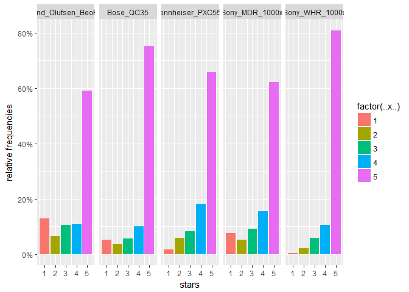
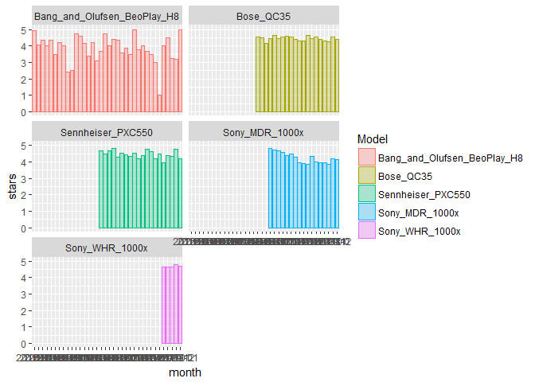
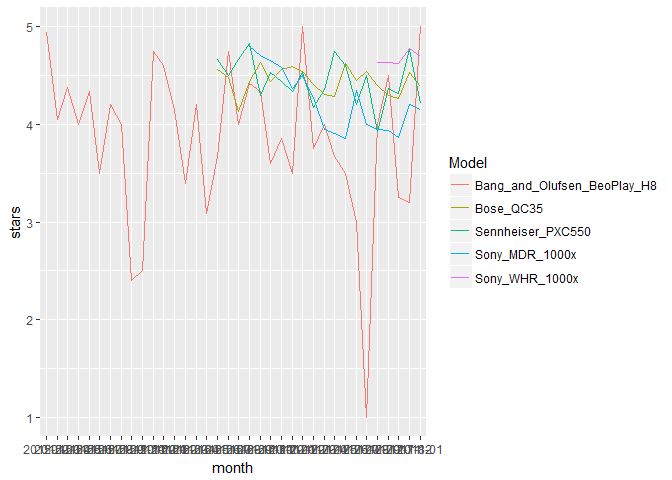
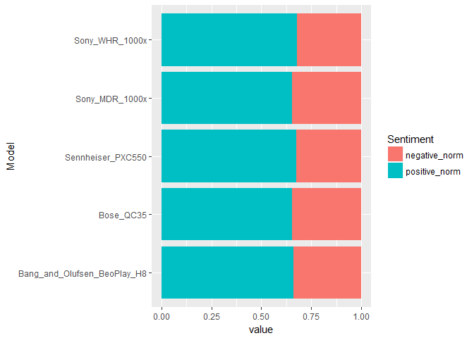
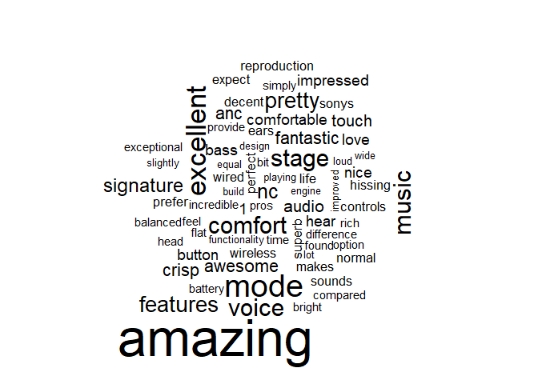

## 1.Step - Obtaining and formatting the data for analysis.

###Loading nessessary packages:

```r
library(dplyr)
library(XML)
library(rvest)
library(stringr)
library(xml2)
library(ggplot2)
library(plyr)
library(readr)
library(tidyverse)
library(tidytext)
library(wordcloud)
```

###First the URL's of the most common models and number of pages of reviews for the chosen models will be defined.

```r
#URLs and n_pages:
url_sony = "https://www.amazon.com/Sony-Cancelling-Bluetooth-Headphone-MDR1000X/product-reviews/B01KHZ4ZYY/ref=cm_cr_dp_d_show_all_btm?ie=UTF8&reviewerType=all_reviews&pageNumber="
n_sony <- 61
url_sony_whr = "https://www.amazon.com/Sony-Noise-Cancelling-Headphones-WH1000XM2/product-reviews/B074KDJVS2/ref=cm_cr_dp_d_show_all_btm?ie=UTF8&reviewerType=all_reviews&pageNumber="
n_sony_whr <- 22
url_bose = "https://www.amazon.com/Bose-QuietComfort-Wireless-Headphones-Cancelling/product-reviews/B01E3SNO1G/ref=cm_cr_dp_d_show_all_btm?ie=UTF8&reviewerType=all_reviews&pageNumber="
n_bose <- 384
url_sennheiser = "https://www.amazon.com/Sennheiser-PXC-550-Wireless-Cancelling/product-reviews/B01E3XLNA0/ref=cm_cr_dp_d_show_all_btm?ie=UTF8&reviewerType=all_reviews&pageNumber="
n_sennheiser <- 29
url_bang_and_ol = "https://www.amazon.com/PLAY-Bang-Olufsen-Headphone-Cancelling/product-reviews/B00R45Z2WU/ref=cm_cr_getr_d_paging_btm_1?ie=UTF8&reviewerType=all_reviews&pageNumber="
n_bang_and_ol <- 20

url = c(url_sony, url_sony_whr, url_bose, url_sennheiser, url_bang_and_ol)
n = c(61, 22, 384, 29, 20)
list_of_models = c("sony_mdr1000x", "sony_whr1000x", "bose_qc35", 
                   "sennheiser_pxc550", "bang_and_olufsen_beoplay_h8")
```

###To find nodes names for later use attributes for all nodes on example of one page will be detemined.

```r
ht = read_html(url_sony)                       #create a XML object
nodes <- xml_find_all(ht, xpath = "//*")       #find all nodes
attrs = xml_attrs(nodes)                       #get attributes of nodes = names of nodes more or less. and then searching "manually"
```

###Function to extract texts, stars and dates of reviews will be assigned.

```r
collect_data <- function(url, n_pages){
  texts = NULL
  stars = NULL
  dates = NULL
  for (i in 1: n_pages){
    page <- read_html(paste0(url, i)) 
    text_page <- cbind(page %>% 
                         html_nodes("#cm_cr-review_list .review-text") %>%     
                         html_text())
    stars_page <- cbind(page %>% 
                          html_nodes("#cm_cr-review_list .review-rating") %>% 
                          html_text() %>% 
                          str_extract("\\d"))
    
    dates_page <- cbind(page %>% 
                          html_nodes("#cm_cr-review_list .review-date") %>% 
                          html_text())
    
    texts <- rbind(texts,text_page)
    stars <- rbind(stars, stars_page)
    dates <- rbind(dates, dates_page)}
  
  total <- cbind(texts, stars, dates)
  
  return(total)
}
```

###With the help of the above mentioned function the data will be collected from the amazon.com.

```r
getOption("timeout")
```

```
## [1] 60
```

```r
options(timeout=4000000)
for (i in 1:length(list_of_models)){
  assign(list_of_models[i], collect_data(url[i], n[i]))
}
```

###But the data is not ready to be analysed yet. First the columns stars and date must be formatted to reasonable format. Stars as integer, dates as datetime. First the function will be asssigned, then it will be applied to the collected data.


```r
parsing <- function(data){
  data = data %>% as_tibble() %>% 
    transmute(Text = V1, stars = as.integer(V2), 
              date = parse_datetime(substr(V3, start = 4, 
                                           stop = length(V3)), "%B %d, %Y") )
  return(data)
}
```


```r
for (i in 1:length(list_of_models)){
  assign(paste(list_of_models[i], "parsed", sep = "_"), 
         parsing(eval(parse(text = list_of_models[i]))))
}
```

###For later analysis all models will be brought to one table.

```r
all_models = bind_rows(sony_mdr1000x_parsed, sony_whr1000x_parsed, 
                       bose_qc35_parsed, sennheiser_pxc550_parsed, 
                       bang_and_olufsen_beoplay_h8_parsed, .id= "Model")

for (i in 1:length(all_models$Model)){
  if (all_models$Model[i] == 1) all_models$Model[i]="Sony_MDR_1000x"
  if (all_models$Model[i] == 2) all_models$Model[i]="Sony_WHR_1000x"
  if (all_models$Model[i] == 3) all_models$Model[i]="Bose_QC35"
  if (all_models$Model[i] == 4) all_models$Model[i]="Sennheiser_PXC550"
  if (all_models$Model[i] == 5) all_models$Model[i]="Bang_and_Olufsen_BeoPlay_H8"
}
head(all_models)
```

```
## # A tibble: 6 x 4
##            Model
##            <chr>
## 1 Sony_MDR_1000x
## 2 Sony_MDR_1000x
## 3 Sony_MDR_1000x
## 4 Sony_MDR_1000x
## 5 Sony_MDR_1000x
## 6 Sony_MDR_1000x
## # ... with 3 more variables: Text <chr>, stars <int>, date <dttm>
```
## 2.Step - Analysing ratings

###First the distribution of the stars will be displayed in a histogram(barplot). Since Bose QC35 has the most reviews, data will be displayed as frequencies.

```r
ggplot(data = all_models, aes(stars, group = Model)) +  
  geom_bar(aes(y = ..prop.., fill = factor(..x..)), stat="count") + 
  scale_y_continuous(labels=scales::percent) +
  ylab("relative frequencies") + facet_grid( ~ Model)
```

<!-- -->
By looking at the histograms can be said, that the most 5 stars got Models of Bose and Sony WHR1000x, the Models which got the most reviews with 1 star are Bang and Olufsen. For the further analysis the data must be observed more in detail.


###As next the average score will be calculated for every discussed model.

```r
for (i in 1:length(list_of_models)){
  cat("\n Average rating of ", list_of_models[i], " is", 
      mean(eval(parse(text = paste(list_of_models[i], "parsed", 
                                   sep = "_")))$stars))}
```

```
## 
##  Average rating of  sony_mdr1000x  is 4.195082
##  Average rating of  sony_whr1000x  is 4.690909
##  Average rating of  bose_qc35  is 4.458073
##  Average rating of  sennheiser_pxc550  is 4.406897
##  Average rating of  bang_and_olufsen_beoplay_h8  is 3.965
```

###Since the averages differ, there is place for a statistical test to determine whether the scores are significantly different or not. Given that the distribution cannot be described neither as normal, nor Poisson or Binomial, the suitable test would be an unpaired wilcoxon test.

```r
wilcox.test(sony_mdr1000x_parsed$stars, sennheiser_pxc550_parsed$stars, 
            alternative = "two.sided", paired = FALSE)
```

```
## 
## 	Wilcoxon rank sum test with continuity correction
## 
## data:  sony_mdr1000x_parsed$stars and sennheiser_pxc550_parsed$stars
## W = 83251, p-value = 0.09709
## alternative hypothesis: true location shift is not equal to 0
```

```r
wilcox.test(sennheiser_pxc550_parsed$stars, bose_qc35_parsed$stars, 
            alternative = "two.sided", paired = FALSE)
```

```
## 
## 	Wilcoxon rank sum test with continuity correction
## 
## data:  sennheiser_pxc550_parsed$stars and bose_qc35_parsed$stars
## W = 514880, p-value = 0.005182
## alternative hypothesis: true location shift is not equal to 0
```

```r
wilcox.test(sony_mdr1000x_parsed$stars, 
            bang_and_olufsen_beoplay_h8_parsed$stars, 
            alternative = "two.sided", paired = FALSE)
```

```
## 
## 	Wilcoxon rank sum test with continuity correction
## 
## data:  sony_mdr1000x_parsed$stars and bang_and_olufsen_beoplay_h8_parsed$stars
## W = 64748, p-value = 0.1351
## alternative hypothesis: true location shift is not equal to 0
```

```r
wilcox.test(sony_mdr1000x_parsed$stars, bose_qc35_parsed$stars, 
            alternative = "two.sided", paired = FALSE)
```

```
## 
## 	Wilcoxon rank sum test with continuity correction
## 
## data:  sony_mdr1000x_parsed$stars and bose_qc35_parsed$stars
## W = 1023500, p-value = 1.151e-10
## alternative hypothesis: true location shift is not equal to 0
```

```r
wilcox.test(sony_whr1000x_parsed$stars, sennheiser_pxc550_parsed$stars, 
            alternative = "two.sided", paired = FALSE)
```

```
## 
## 	Wilcoxon rank sum test with continuity correction
## 
## data:  sony_whr1000x_parsed$stars and sennheiser_pxc550_parsed$stars
## W = 36800, p-value = 0.0001548
## alternative hypothesis: true location shift is not equal to 0
```
The significance level alpha will be taken by 5%. 
By the comparisons of models Sony MDR1000x with Sennheiser PXC550 and Sony MDR1000x with Bang and Olufsen Beoplay H8 the p-values are strenghtly above 5%, what means that the Null-Hypothesis of the Models being same good (having same good reviews) cannot be rejected. Probably these models in these pairs are same good.
By the comparisons of models Bose QC35 with Sennheiser PXC550 and Sony MDR1000x with Bose QC35 the p-values are strenghtly under 5%, what means that the Null-Hypothesis of the Models being same good (having same good reviews) should be rejected. There can be said that Bose QC35 is statistically significantly better than Sennheiser PXC550 and Sony MDR1000x.


###Monthly observed averages to see how the ratings were evolving with the time. Whether new models, new technologies influenced the rating of mentioned models.

```r
all_models_monthly = all_models %>% 
  mutate(month = format(date, format = "%Y-%m")) %>% 
  dplyr:: group_by(Model, month) %>% 
  dplyr:: summarise(stars = mean(stars)) 

all_models_monthly = all_models_monthly[order(all_models_monthly$month),]

ggplot(data = all_models_monthly, aes(x = month, y = stars, fill = Model, 
                                      color = Model)) + 
  geom_bar(stat = "identity", position = "identity", alpha = .3) + 
  facet_wrap( ~ Model, ncol = 2)
```

<!-- -->
The first thing that can be seen is that the model of Banf and Olufsen is the oldest on the market and the Sony WHR 1000x the newest.
By looking only at these histograms there cannot be claimed that there was any notable falling or raising in reviews with the time. Only by Sony MDR1000x there was some falling but then also raising in reviews. Maybe displayng the graphs together will bring more information.

###Displaying together:

```r
ggplot(data = all_models_monthly, aes(x = month, y = stars, group = Model, 
                                      color = Model)) +  geom_line()
```

<!-- -->
Plotting all evolution of the reviews together unfortunately is not giving the answer on the question "Why reviews on Sony MDR 1000x" are falling first and then raising again. Apparently it is not influenced by the other models.
But this plot is showing how close is the evolution of reviews for Sennheiser and Bose. They appeared at the market at the same time and in the beginning raising rating of one model was connected to falling ratings of the other but then they get closer to each other and have very similar ratings. 


##3.Step - Sentiment analysis

###As a first step the data will be pepared for the purpose of sentiment analysis. For that all reviews texts for each model will be joined, assigned to the variables and merged in one table.

```r
sentiment_analysis <- function(data){
  data = data$Text %>% unlist()
  tokens = data_frame(text = data) %>% unnest_tokens(word, text)
  tokens = tokens %>% inner_join(get_sentiments("bing")) %>% 
    dplyr:: count(sentiment) %>% spread(sentiment, n, fill = 0) %>% 
    mutate(sentiment = positive - negative)
  return(tokens)
}
```


```r
for (i in 1:length(list_of_models)){
  assign(paste(list_of_models[i], "sentiment", sep = "_"), 
         sentiment_analysis(eval(parse(text = paste(list_of_models[i], 
                                                    "parsed", sep = "_")))))
}
```

```
## Joining, by = "word"
## Joining, by = "word"
## Joining, by = "word"
## Joining, by = "word"
## Joining, by = "word"
```


```r
sentiment_total = bind_rows(sony_mdr1000x_sentiment, sony_whr1000x_sentiment,
                            bose_qc35_sentiment, sennheiser_pxc550_sentiment, 
                            bang_and_olufsen_beoplay_h8_sentiment, .id= "Model")

for (i in 1:length(sentiment_total$Model)){
  if (sentiment_total$Model[i] == 1) sentiment_total$Model[i]="Sony_MDR_1000x"
  if (sentiment_total$Model[i] == 2) sentiment_total$Model[i]="Sony_WHR_1000x"
  if (sentiment_total$Model[i] == 3) sentiment_total$Model[i]="Bose_QC35"
  if (sentiment_total$Model[i] == 4) sentiment_total$Model[i]="Sennheiser_PXC550"
  if (sentiment_total$Model[i] == 5) sentiment_total$Model[i]="Bang_and_Olufsen_BeoPlay_H8"
}
```

The Illustration will be pesented as a barplot of normed values.

```r
sentiment_gathered = sentiment_total %>% 
  mutate(negative_norm = negative/(negative+positive), 
         positive_norm = positive/(negative+positive)) %>% 
  gather(-Model, -sentiment, -positive, -negative, 
         key = c(positive_norm, negative_norm), value = value) %>% 
  dplyr:: rename(Sentiment = `c(positive_norm, negative_norm)`)

ggplot(data = sentiment_gathered, aes(x = Model, y = value, fill = Sentiment)) +
  geom_bar(stat = "identity") + coord_flip()
```

<!-- -->
Sentiment analysis shows approximately identical proportion of positive and negative words in the reviews.

As a conclusion can be said that all models have approximately same ratings, do not demonstrate any connection of the ratings to the time and none of models have more positive words relation to the negative than the others.
But according to testing the reviews statistically significantly better than the other models can be named Bose QC35 and Sony WHR 1000x.

## 4.Step - individual analysis

Since previous analysis is not giving the clear answer which Model is the best some individual analysis can be useful. To do so we can look at how people described mai characteristics, like sound or noise cancellation for example. For this purpose the neighbouring words of the words of interest will be researched and drawn as a cloud of words. An example follows.

###First the function to find neighbouring words will be defined:

```r
get_neigbouring_words <- function(text, look_for, pre = 3, post = pre){
  matches = which(text == look_for)
  
  if(length(matches) > 0) {
    found_words = sapply(matches, function(m) text[(m-pre):(m+post)])
    return(found_words)
  } else {
    warning("No matches")
  }
}
```

###Then the function will be applied:

```r
text = sony_mdr1000x_parsed$Text %>% unlist() 
tokens = data_frame(text = text) %>% unnest_tokens(word, text)
sound = get_neigbouring_words(tokens$word, "sound")
sound_unlist = sound[c(1:3, 5:7), ] %>% as_tibble() %>% unlist()
```

###Drawing cloud of words:

```r
custom_stop_words = bind_rows(data_frame(word = c("headphones", "headphone",
                                                  "quality", "sony", "bose",
                                                  "ambient", "cancelling",
                                                  "cancellation", "qc35",
                                                  "1000x", "noise", "canceling",
                                                  "bluetooth", "sound",
                                                  "sony's"), 
                                         lexicon = c("custom")),
                              tidytext::  stop_words)

cloud_of_words <- function(data){
  tokens = data_frame(text = data) %>% unnest_tokens(word, text)
  count_words = tokens %>% anti_join(custom_stop_words) %>% count() 
  count_words = count_words[order(-count_words$freq),]
  count_words %>% with(wordcloud(word, freq, max.words = 70))
}
cloud_of_words(sound_unlist)
```

```
## Joining, by = "word"
```

<!-- -->

Thus, we can get the feeling of what people thought about the sound in Sony MDR 1000x.
